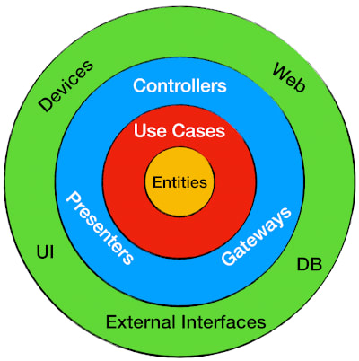

# **Clean Node API**
API em desenvolvimento. Estudo do curso do professor Rodrigo Manguinho (Mango) na Udemy

---

O objetivo do treinamento é mostrar como criar uma API com uma arquitetura bem definida e desacoplada, utilizando
TDD (programação orientada a testes) como metodologia de trabalho, Clean Architecture para fazer a distribuição de
responsabilidades em camadas, sempre seguindo os princípios do SOLID e, sempre que possível, aplicando Design
Patterns para resolver alguns problemas comuns.
### [**Link para o curso completo**](https://www.udemy.com/course/tdd-com-mango/?referralCode=B53CE5CA2B9AFA5A6FA1)
 

## [**Link para a documentação da API**](https://ts-tdd-ddd-cleanarchitecture.herokuapp.com/api-docs/#/Login/post_login)

> ## APIs construídas no treinamento

1. [Cadastro](./requirements/signup.md)
2. [Login](./requirements/login.md)
3. [Criar enquete](./requirements/add-survey.md)
4. [Listar enquetes](./requirements/list-surveys.md)
5. [Responder enquete](./requirements/save-survey-result.md)
6. [Resultado da enquete](./requirements/get-survey-result.md)

> ## Princípios

* Single Responsibility Principle (SRP)
* Open Closed Principle (OCP)
* Liskov Substitution Principle (LSP)
* Interface Segregation Principle (ISP)
* Dependency Inversion Principle (DIP)
* Separation of Concerns (SOC)
* Don't Repeat Yourself (DRY)
* You Aren't Gonna Need It (YAGNI)
* Keep It Simple, Silly (KISS)
* Composition Over Inheritance
* Small Commits

> ## Design Patterns

* Factory
* Adapter
* Composite
* Decorator
* Proxy
* Dependency Injection
* Singleton

> ## Metodologias e Designs

* TDD
* Clean Architecture
* DDD
* Conventional Commits
* GitFlow
* Modular Design
* Dependency Diagrams
* Use Cases
* Continuous Integration
* Continuous Delivery
* Continuous Deployment

> ## Bibliotecas e Ferramentas

* NPM
* Typescript
* Git
* Docker
* Jest
* MongoDb
* Travis CI
* Swagger
* Bcrypt
* JsonWebToken
* Coveralls
* Validator
* Express
* Supertest
* Husky
* Eslint
* Standard Javascript Style
* Sucrase
* Nodemon
* Rimraf
* In-Memory MongoDb Server
* MockDate
* Module-Alias
* Bson ObjectId

> ## Features do Node

* Documentação de API com Swagger
* API Rest com Express
* Log de Erro
* Segurança (Hashing, Encryption e Encoding)
* CORS
* Middlewares
* Nível de Acesso nas Rotas (Admin, User e Anônimo)
* Deploy no Heroku
* Servir Arquivos Estáticos

> ## Features do GraphQL

* Types
* Queries
* Mutations
* Directives
* Plugins

> ## Features do Git

* Alias
* Log Personalizado
* Branch
* Reset
* Amend
* Tag
* Stash
* Rebase
* Merge

> ## Features do Typescript

* POO Avançado
* Interface
* TypeAlias
* Namespace
* Utility Types
* Modularização de Paths
* Configurações
* Build
* Deploy
* Uso de Breakpoints

> ## Features de Testes

* Testes Unitários
* Testes de Integração (API Rest)
* Cobertura de Testes
* Mocks
* Stubs
* Spies

> ## Features do MongoDb

* Connect e Reconnect
* Collections
* InsertOne e InserMany
* Find, FindOne e FindOneAndUpdate
* DeleteMany
* UpdateOne
* ObjectId
* Upsert e ReturnOriginal
